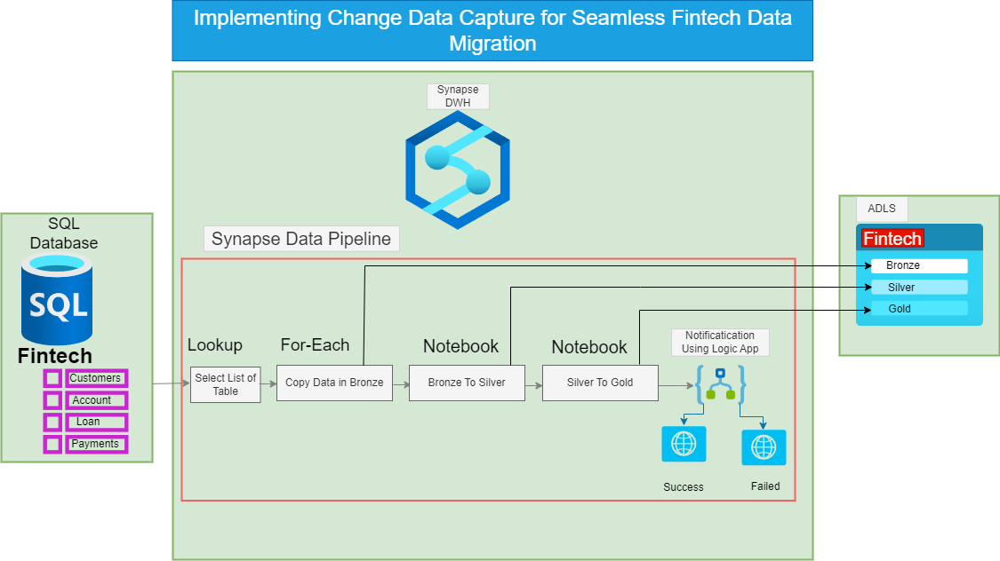
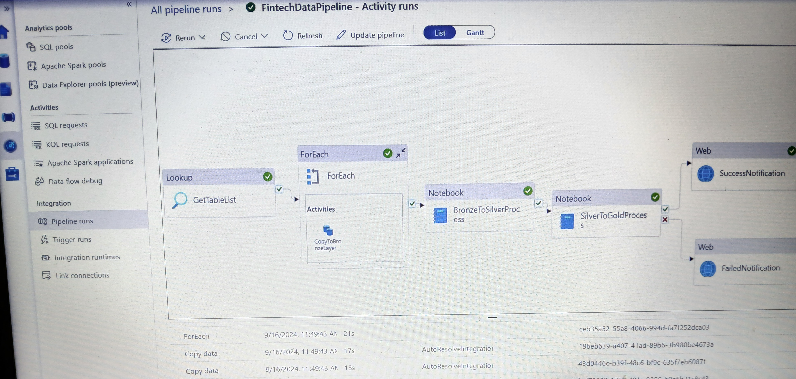

### **End-to-End Data Engineering pipeline On Fintech Data Migration**

### **Introduction**
This project demonstrates the migration of data from a **relational SQL Server database** to a **cloud-based Azure architecture**. The process involves moving financial data from a traditional SQL database to **Azure Data Lake Storage (ADLS)** using a structured and scalable approach.
### **Architecture**

The data migration and transformation process is organized using the **Bronze, Silver, and Gold** layer architecture:
- **Bronze Layer**: Raw data extracted from the source.
- **Silver Layer**: Data quality checks and transformations applied.
- **Gold Layer**: Fully processed data, ready for analytics and reporting.
A Synapse pipeline was created to automate the **extraction, loading, and transformation (ELT)** processes, ensuring seamless data flow through these layers. After transformations, the final data from the **Gold Layer** is stored in **SynapseDWH** for further use.

### **Technology Used**

1. **Programming Language**: Python  
2. **Scripting Language**: SQL  
3. **Data Processing**: PySpark  
4. **Azure Cloud Platform**:
   - Azure Data Lake Storage (ADLS)
   - Azure SQL Database
   - Delta Tables
   - Azure Synapse Analytics

### **Step 1: SQL Server to Bronze Layer**
The first step involved migrating tables from the SQL Server into the Bronze Layer in ADLS. Initially, separate copy activities were created for each table, but this approach was automated using **Lookup** and **ForEach** activities, which dynamically fetch the list of tables and loop through each to execute the copy activity, eliminating manual work.

Key Components:
- **SQL Server**: Source database.
- **Azure Data Lake Storage (ADLS)**: Storage for raw data in the Bronze Layer.
- **Synapse Pipeline**: Used to automate data movement from SQL Server to ADLS.

**Step 2: Moving Data from Bronze to Silver Layer**  
Once in the Bronze Layer, data underwent validation and transformation using **Notebook 1**. The transformed data was stored in the Silver Layer, where it is cleaned and ready for further processing.

**Step 3: Moving Data from Silver to Gold Layer**  
**Notebook 2** handled further transformations and aggregations on the Silver Layer data, moving the final processed data to the Gold Layer, which is now ready for analytics, reporting, and querying.

**Step 4: Notification Setup with Logic App**  
Azure **Logic App** was configured to send email notifications upon pipeline success or failure, ensuring stakeholders are informed about the pipeline execution.

### **Challenges Encountered**
- **Initial Manual Configuration**: Creating individual copy activities for each table was inefficient, later resolved by using dynamic activities.
- **Error Handling**: Connection issues with SQL Server, ADLS, and Synapse required troubleshooting during the pipeline execution.

### **Scripts and data for this Project**
1. [Spark-notebook](spark-notebook/BronzeToSilverDataProcess.ipynb)
2. [Spark-notebook](spark-notebook/SilverToGoldDataProcess.ipynb)
3. [Sql-Database-Table-Accounts](Sql-Database-Table/Accounts.sql)
4. [Sql-Database-Table-Customers](Sql-Database-Table/Customers.sql)
5. [Sql-Database-Table-Loans](Sql-Database-Table/Loans.sql)
6. [Sql-Database-Table-Payments](Sql-Database-Table/Payments.sql)
7. [Sql-Database-Table-Transactions](Sql-Database-Table/Transactions.sql)
### **Conclusion**

The project successfully implemented a Lakehouse architecture for fintech data migration. By automating the data migration process with Synapse Pipelines and organizing data into Bronze, Silver, and Gold layers in ADLS, a scalable, efficient, and agile architecture was created. This design supports future analytics and reporting needs, with Synapse and Logic Apps providing a robust orchestration and notification mechanism.

